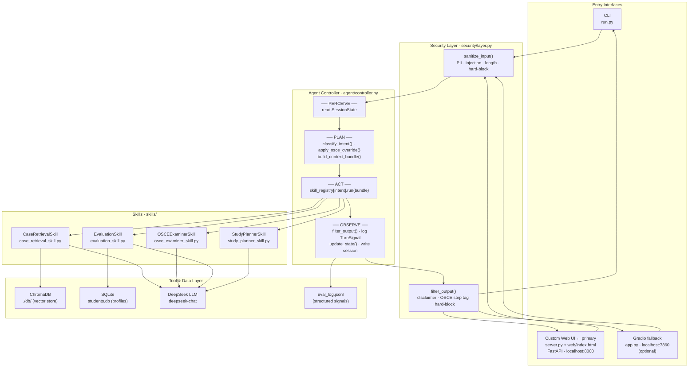

# SurgMentor — Agentic Surgical OSCE Trainer

**Kaggle AI Agents Intensive Capstone · *Agents for Good* track**

> An agentic system that gives surgical residents on-demand access to structured OSCE practice — no human examiner required.

---

## Overview

Expert surgical examiners are scarce. A resident outside a major academic centre may get a fraction of the OSCE practice that evidence recommends, and clinical reasoning degrades without deliberate repetition.

RAG alone cannot solve this. A retrieval pipeline can fetch a relevant case, but it cannot maintain conversational state across a multi-turn examination, enforce a consistent scoring rubric, or adapt recommendations to a student's historical weak areas. SurgMentor's agent loop — perceive → plan → act → observe — handles all of that through four composable skills routed by a stateful controller.

---

## Architecture


Five strictly separated layers: **Entry Interfaces** feed through a **Security Layer** (pre-flight sanitisation) into the **Agent Controller**, which routes to one of four **Skills** and persists results in the **Tool/Data Layer** (ChromaDB, SQLite, DeepSeek, eval log).

<details>
<summary>Mermaid diagram</summary>



</details>

---

## Skills

| Skill | Responsibility | Course concept |
|-------|---------------|----------------|
| `CaseRetrievalSkill` | Embeds query → ChromaDB cosine search → top-3 cases with source citations; biases toward student's historical weak areas | Agent Skills (Day 3) |
| `OSCEExaminerSkill` | 3-phase state machine (init / turn / finish): presents patient case, asks follow-up questions, hands off to EvaluationSkill | Agent Skills (Day 3) |
| `EvaluationSkill` | Scores completed OSCE 0–10 via LLM rubric; extracts weak areas; persists to SQLite | Evaluation (Day 4) |
| `StudyPlannerSkill` | Reads historical weak areas from SQLite; generates personalised remediation study plan | Agent Skills (Day 3) |

---

## Course Concepts

| Concept | Implementation | File |
|---------|---------------|------|
| **Agent Architecture** | `AgentController.run()` — explicit PERCEIVE → PLAN → ACT → OBSERVE steps with inline labels | `surgmentor/agent/controller.py` |
| **Context Engineering** | `build_context_bundle()` — per-skill trimmed SessionState view; reduces token cost and hallucination risk | `surgmentor/agent/context.py` |
| **Agent Skills** | `Skill` ABC + 4 concrete classes; each independently testable; controller routes via `_registry[intent]` | `surgmentor/skills/` |
| **Security Features** | `sanitize_input()` pre-flight (PII, injection, length, hard-block) + `filter_output()` post-flight (disclaimer, step tag) | `surgmentor/security/layer.py` |
| **Evaluation** | `TurnSignal` logged after every controller cycle; `SessionEvaluation` logged per OSCE; machine-readable `eval_log.jsonl` | `surgmentor/evaluation/logger.py` |
| **Deployability** | CLI, FastAPI web UI, and optional Gradio fallback — no cloud infrastructure required | `run.py`, `server.py`, `app.py` |

---

## Quick Start

**Requirements:** Python 3.10 or 3.11 · DeepSeek API key ([free tier](https://platform.deepseek.com))

> A pre-built ChromaDB vector store (5 surgical cases, `chromadb==0.5.23`) is included — no Jina AI key needed to run out of the box.

```bash
git clone https://github.com/reza3673/SurgMentor-Capstone.git
cd SurgMentor-Capstone
pip install -r requirements.txt
cp .env.example .env   # add DEEPSEEK_API_KEY

# Recommended: custom web UI
python -m uvicorn server:app --host 0.0.0.0 --port 8000
# → open http://localhost:8000
```

<details>
<summary>Rebuild the vector database from scratch (optional)</summary>

Requires a Jina AI API key and ~2 minutes. `chromadb==0.5.23` must be installed.

```bash
JINA_API_KEY=your-key python scripts/01_prepare_data.py
JINA_API_KEY=your-key python scripts/02_embed_and_store.py
python scripts/03_test_retrieval.py   # verify retrieval works
```

</details>

<details>
<summary>Run the test suite</summary>

```bash
# Sandbox-safe (no API keys required)
CI_NO_LLM=1 CI_NO_GRADIO=1 python -m unittest discover -s tests -v
# Expected: 241 passed, 11 skipped, 0 failures

# Full suite (API keys required)
python -m unittest discover -s tests -v
# Expected: 252 tests, 0 failures, 0 skipped
```

</details>

---

## Interfaces

### Custom Web UI — primary

```bash
python -m uvicorn server:app --host 0.0.0.0 --port 8000
```

Three views at `http://localhost:8000`:

| View | Function |
|------|----------|
| **Chat** | Case retrieval and Q&A with source citations |
| **OSCE** | Structured examination — six-step progress indicator and End & Score button |
| **Profile** | Historical performance and personalised study plan generation |

No login required.

### CLI

```
$ python run.py

╔══════════════════════════════════════════════════════╗
║          SurgMentor — Agentic OSCE Trainer           ║
║          Kaggle AI Agents Intensive 2026             ║
╚══════════════════════════════════════════════════════╝
Session ID : 3f8a2c1d-...
Type 'help' for available commands.
──────────────────────────────────────────────────────

You: show me a case about right iliac fossa pain
SurgMentor: [retrieves top-3 ChromaDB cases, cites case IDs and similarity scores]

You: start osce
SurgMentor: [OSCEExaminer presents patient case and asks first clinical question]

You: exit
```

Type `reset` to start a new session. Type `help` for all commands.

### Gradio (optional fallback)

```bash
python app.py
# → http://localhost:7860
```

Three-tab interface covering the same functionality. Use if the web UI is unavailable or for quick local testing.

---

## Demo

🎬 **Video:** [YOUTUBE_URL_TO_ADD_AFTER_RECORDING]

### Reproduce manually (5 steps)

1. Launch the web UI → open `http://localhost:8000`
   *Demonstrates: Deployability*

2. **Chat** → type `show me a case about right iliac fossa pain`
   → `RETRIEVE_CASE` → `CaseRetrievalSkill` → response includes `Sources:` citations
   *Demonstrates: Agent Skills, Context Engineering*

3. **OSCE** → click **Start Session**
   → `START_OSCE` → `OSCEExaminerSkill._init()` → examiner opens case; progress indicator advances to Step 1
   *Demonstrates: Agent Architecture — stateful session initiated*

4. **OSCE** → enter 2–3 clinical reasoning responses
   → OSCE override rule forces `OSCEExaminerSkill._turn()` regardless of intent classification
   *Demonstrates: Agent Architecture — state maintained across turns*

5. **OSCE** → click **End & Score**
   → `EvaluationSkill` scores 0–10; feedback and weak areas displayed
   → **Profile** → Refresh shows session in historical record; `eval_log.jsonl` updated
   *Demonstrates: Evaluation, Security Features*

---

## Evaluation Log

Every agent cycle appends one entry to `eval_log.jsonl`:

```json
{
  "session_id": "3f8a2c1d-...",
  "intent_classified": "OSCE_TURN",
  "skill_selected": "OSCEExaminerSkill",
  "output_safety_pass": true,
  "latency_ms": 812,
  "timestamp": "2026-06-20T14:22:31"
}
```

Inspect after a session:

```bash
python -c "
import json
for line in open('eval_log.jsonl'):
    print(json.dumps(json.loads(line), indent=2))
"
```

---

## Project Structure

```
SurgMentor-Capstone/
├── run.py                          # CLI entry point
├── server.py                       # FastAPI server — primary web interface
├── web/
│   └── index.html                  # Custom SPA (HTML/CSS/JS)
├── app.py                          # Gradio web UI (optional fallback)
├── config.py                       # Environment-based configuration
├── clients.py                      # DeepSeek client singleton
├── surgmentor/
│   ├── agent/                      # Controller, intent classifier, context builder
│   ├── security/                   # Input sanitizer and output filter
│   ├── skills/                     # 4 composable skill implementations
│   ├── rag/                        # ChromaDB retrieval tools
│   ├── memory/                     # SQLite persistence + session state
│   ├── evaluation/                 # TurnSignal and SessionEvaluation logger
│   └── ui/                         # Shared UI helpers
├── scripts/                        # Data pipeline: Excel → JSON → ChromaDB
├── tests/                          # 252 tests across 6 test files
├── data/
│   └── cases.xlsx                  # Source surgical cases
└── docs/                           # Architecture assets, video script, and Kaggle writeup
```

---

## Agents for Good

Surgical mortality is disproportionately high in low- and middle-income countries, where expert examiners are fewest and structured OSCE practice is hardest to access. SurgMentor makes on-demand OSCE practice available 24/7 — removing the scarcest bottleneck in surgical education.

---

## License

MIT License. See [LICENSE](LICENSE).
