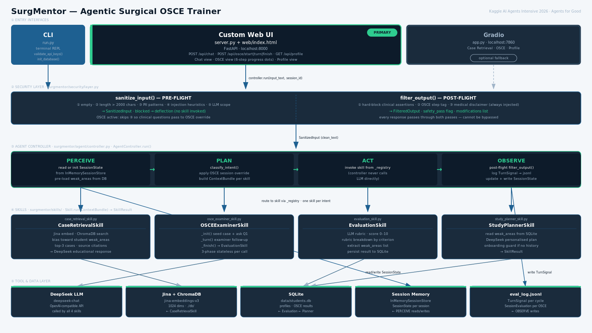
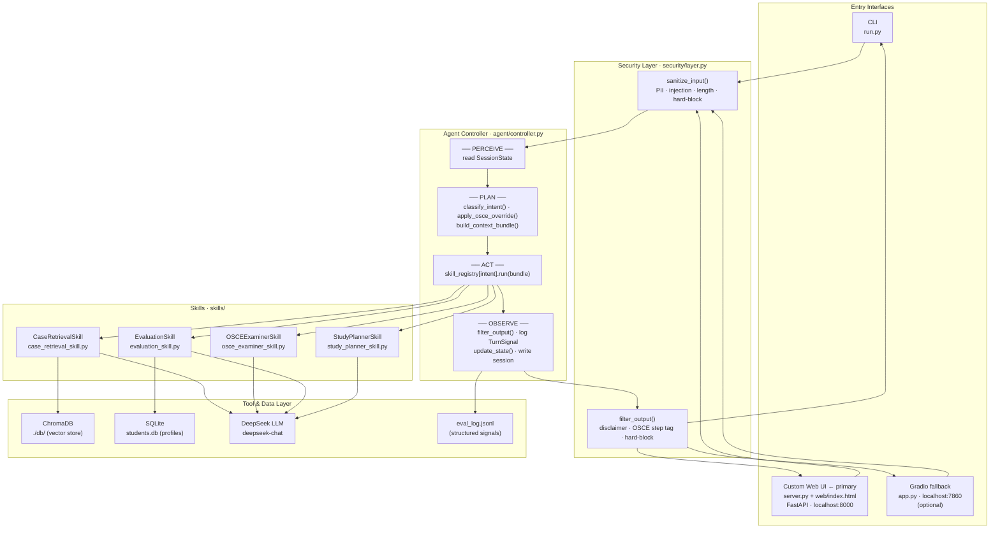

# SurgMentor — Agentic Surgical OSCE Trainer

**Kaggle AI Agents Intensive Capstone Project — *Agents for Good* track**

> An agentic system that gives surgical residents unlimited access to structured
> OSCE examination practice — without requiring a human expert examiner.

---

## The Problem

Objective Structured Clinical Examinations (OSCEs) are the gold standard for
assessing surgical clinical reasoning. They require a trained examiner to present
a patient case, ask follow-up questions, and score the trainee's responses against
a structured rubric. This works well in resource-rich teaching hospitals — but expert
examiners are scarce, their time is expensive, and the number of practice sessions
a resident can access is sharply limited by their availability.

The consequence is measurable: surgical trainees in lower-resource settings, or
outside formal teaching rotations, get far fewer OSCE practice opportunities than
evidence recommends. Clinical reasoning is a skill that degrades without deliberate
practice. The gap between "trained in a major academic centre" and "trained
elsewhere" is, in part, a gap in access to structured practice with feedback.

---

## Why Agents?

A retrieval-augmented pipeline (RAG alone) cannot solve this problem. RAG can fetch
a relevant case, but it cannot maintain conversational state across a multi-turn
examination, enforce a consistent scoring rubric, switch between pedagogical modes
(free teaching vs. structured examination vs. remediation), or adapt its
recommendations to the student's specific historical weak areas. These requirements
demand an agent loop: a system that perceives student input, classifies intent
within session context, selects the right skill for the current mode, and evaluates
its own output — all while maintaining state across turns. The four skills in
SurgMentor (case retrieval, OSCE examination, evaluation, study planning) are
independently testable and composable precisely because the controller, not the
skills, owns state and routing. This is the design that the Kaggle AI Agents
Intensive course teaches, and it is the right design for this problem.

---

## Architecture





Five layers, strictly separated: Entry Interfaces call into the Security Layer
(pre-flight), the Agent Controller runs the perceive → plan → act → observe loop,
Skills are invoked as stateless units via a registry, and the Tool/Data Layer
contains ChromaDB (vector search), SQLite (student profiles), the DeepSeek LLM,
and the evaluation log.

---

## Skills

| Skill | Purpose | Course concept |
|-------|---------|----------------|
| `CaseRetrievalSkill` | Embed student query → ChromaDB cosine search → return top-3 cases with sources; biases search toward the student's historical weak areas | Agent Skills (Day 3) |
| `OSCEExaminerSkill` | 3-phase state machine (init / turn / finish): presents a patient case, asks follow-up questions, hands off to EvaluationSkill on completion | Agent Skills (Day 3) |
| `EvaluationSkill` | Scores a completed OSCE session 0–10 via LLM rubric; extracts weak areas; persists result to SQLite | Evaluation (Day 4) |
| `StudyPlannerSkill` | Reads historical weak areas from SQLite; generates a personalised remediation study plan | Agent Skills (Day 3) |

---

## Course Concepts Demonstrated

| Concept | Where in code | File |
|---------|--------------|------|
| **Agent Architecture / ADK loop** | `AgentController.run()` — explicit PERCEIVE → PLAN → ACT → OBSERVE steps with inline comment labels | `surgmentor/agent/controller.py` |
| **Context Engineering** | `build_context_bundle()` — per-skill trimmed view of SessionState; reduces token cost and hallucination risk | `surgmentor/agent/context.py` |
| **Agent Skills** | `Skill` ABC + 4 concrete skill classes; each independently testable; controller routes via `_registry[intent]` | `surgmentor/skills/` |
| **Security Features** | `SecurityLayer.sanitize_input()` pre-flight (PII, injection, length, hard-block) + `filter_output()` post-flight (disclaimer, step tag) | `surgmentor/security/layer.py` |
| **Evaluation** | `TurnSignal` logged after every controller cycle; `SessionEvaluation` logged per OSCE; machine-readable `eval_log.jsonl` | `surgmentor/evaluation/logger.py` |
| **Deployability** | CLI (`python run.py`), custom FastAPI web UI (`python -m uvicorn server:app --host 0.0.0.0 --port 8000`), and optional Gradio fallback (`python app.py`); no cloud infrastructure required | `run.py`, `server.py`, `app.py` |

---

## Setup

### Prerequisites

- Python 3.10 or 3.11
- DeepSeek API key — [platform.deepseek.com](https://platform.deepseek.com) (free tier works)

> **Note:** A pre-built vector database (5 surgical cases, ChromaDB 0.5.23) is
> included in the repository. A Jina AI API key is **not required** to run the
> system out of the box. It is only needed if you want to rebuild the vector store
> from scratch (see step 4 below).

### Installation

```bash
# 1. Clone the repository
git clone https://github.com/reza3673/SurgMentor-Capstone.git
cd SurgMentor-Capstone

# 2. Install dependencies
pip install -r requirements.txt

# 3. Configure environment
cp .env.example .env
# Open .env and fill in DEEPSEEK_API_KEY
# (JINA_API_KEY only needed if rebuilding the vector database)

# 4. Run
python run.py       # CLI demo
# or — custom web UI (primary, recommended)
python -m uvicorn server:app --host 0.0.0.0 --port 8000
# then open http://localhost:8000
# or — Gradio fallback (optional)
python app.py       # http://localhost:7860
```

<details>
<summary>Rebuilding the vector database from scratch (optional)</summary>

The pre-built `db/` directory works out of the box. To rebuild from scratch
(requires a Jina AI API key and ~2 minutes):

```bash
JINA_API_KEY=your-key python scripts/01_prepare_data.py
JINA_API_KEY=your-key python scripts/02_embed_and_store.py
python scripts/03_test_retrieval.py   # verify retrieval works
```

> **Note:** chromadb==0.5.23 must be installed (see requirements.txt).
> The pre-built db/ was generated with this exact version.

</details>

<details>
<summary>Running the test suite</summary>

```bash
# Sandbox-safe (no API keys required)
CI_NO_LLM=1 CI_NO_GRADIO=1 python -m unittest discover -s tests -v
# Expected: 241 passed, 11 skipped, 0 failures

# Full suite (API keys required)
python -m unittest discover -s tests -v
# Expected: 252 tests, 0 failures, 0 skipped
```

</details>

---

## Running SurgMentor

### CLI

```
$ python run.py

╔══════════════════════════════════════════════════════╗
║          SurgMentor — Agentic OSCE Trainer           ║
║          Kaggle AI Agents Intensive 2026             ║
╚══════════════════════════════════════════════════════╝
Session ID : 3f8a2c1d-...
Type 'help' for available commands.
──────────────────────────────────────────────────────

You: show me a case about right iliac fossa pain
SurgMentor: [retrieves top-3 ChromaDB cases, cites case IDs and similarity scores]

You: start osce
SurgMentor: [OSCEExaminer presents patient case and asks first clinical question]

You: exit
```

Type `reset` to start a new session. Type `help` for all commands.

### Custom Web UI (primary)

```bash
python -m uvicorn server:app --host 0.0.0.0 --port 8000
# Opens at http://localhost:8000
```

Three views: **Chat** (case retrieval and Q&A with source citations), **OSCE**
(structured examination with six-step progress indicator and End & Score button),
**Profile** (historical performance and study plan generation). No login required.

### Gradio fallback (optional)

```bash
python app.py
# Opens at http://localhost:7860
```

Three-tab Gradio interface covering the same functionality. Use if the custom web
UI is unavailable or for quick local testing.

---

## Demo

🎬 **Video:** [YOUTUBE_URL_TO_ADD_AFTER_RECORDING]

### Reproduce the demo manually (5 steps)

1. `python -m uvicorn server:app --host 0.0.0.0 --port 8000` → open `http://localhost:8000`
   *Demonstrates: Deployability — custom FastAPI web interface*

2. **Chat** view → type `show me a case about right iliac fossa pain`
   → Agent classifies `RETRIEVE_CASE` → `CaseRetrievalSkill` → response includes
   case context and `Sources:` citations
   *Demonstrates: Agent Skills, Context Engineering*

3. **OSCE** view → click **Start Session**
   → Agent classifies `START_OSCE` → `OSCEExaminerSkill._init()` → examiner
   presents a patient case and asks the opening question; six-step progress
   indicator advances to Step 1
   *Demonstrates: Agent Architecture (stateful session initiated)*

4. **OSCE** view → enter 2–3 clinical reasoning responses
   → Each turn: OSCE override rule routes to `OSCEExaminerSkill._turn()`
   regardless of intent classification; examiner follows up
   *Demonstrates: Agent Architecture (session state maintained across turns)*

5. **OSCE** view → click **End & Score**
   → `EvaluationSkill` scores the session; score panel with feedback and weak areas displayed
   → **Profile** view → **Refresh** shows the session in historical record
   → `eval_log.jsonl` receives a `TurnSignal` entry for every turn
   *Demonstrates: Evaluation, Security Features (disclaimer injected in output)*

---

## Evaluation Evidence

Every agent cycle writes one JSON object to `eval_log.jsonl`:

```json
{
  "session_id": "3f8a2c1d-...",
  "intent_classified": "OSCE_TURN",
  "skill_selected": "OSCEExaminerSkill",
  "output_safety_pass": true,
  "latency_ms": 812,
  "timestamp": "2026-06-20T14:22:31"
}
```

Inspect the log after a session:

```bash
python -c "
import json
for line in open('eval_log.jsonl'):
    print(json.dumps(json.loads(line), indent=2))
"
```

---

## Project Structure

```
SurgMentor-Capstone/
├── run.py                          # CLI entry point
├── server.py                       # FastAPI server — primary web interface
├── web/
│   └── index.html                  # Custom SPA (HTML/CSS/JS)
├── app.py                          # Gradio web UI (optional fallback)
├── config.py                       # Environment-based configuration
├── clients.py                      # DeepSeek client singleton
├── surgmentor/
│   ├── agent/                      # Controller, intent classifier, context builder
│   ├── security/                   # Input sanitizer and output filter
│   ├── skills/                     # 4 composable skill implementations
│   ├── rag/                        # ChromaDB retrieval tools
│   ├── memory/                     # SQLite persistence + session state
│   ├── evaluation/                 # TurnSignal and SessionEvaluation logger
│   └── ui/                         # Shared UI helpers
├── scripts/                        # Data pipeline: Excel → JSON → ChromaDB
├── tests/                          # 252 tests across 6 test files
├── data/
│   └── cases.xlsx                  # Source surgical cases
└── docs/                           # Architecture assets, video script, and Kaggle writeup
```

---

## Agents for Good

SurgMentor targets the global surgical training gap. Surgical mortality is
disproportionately high in low- and middle-income countries, where access to
structured OSCE practice is most limited and expert examiners are fewest. The
agent system makes structured OSCE practice available on-demand, 24/7, without
requiring an expert examiner to be present — removing the scarcest bottleneck in
surgical education.

---

## License

MIT License. See [LICENSE](LICENSE).
