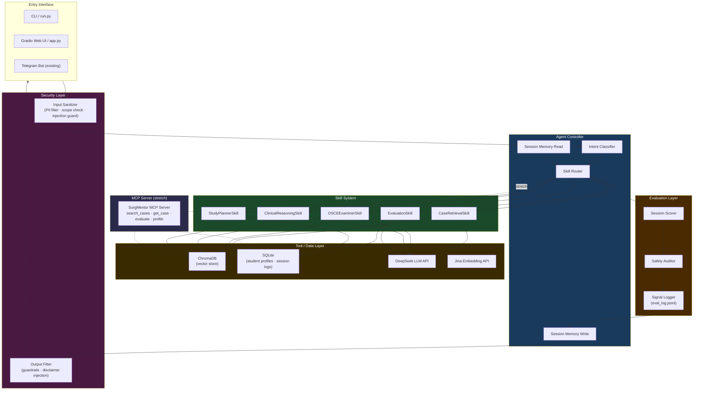

# TARGET_ARCHITECTURE.md

**Project:** SurgMentor — Agentic Surgical Education System  
**Track:** Agents for Good  
**Date:** 2026-06-20  
**Source documents:** PROJECT_UNDERSTANDING.md, GAP_ANALYSIS.md, project_docs/01–05, SURGMENTOR_MISSION.md  

> This document defines the ideal target architecture for the competition submission. It is written without assuming access to the current source code. Source reuse decisions are addressed in Section 15.

---

## 1. High-Level Architecture

SurgMentor's competition-ready system is a **multi-skill, orchestrated agentic platform** for surgical education. It is not a chatbot. It is not a RAG pipeline with a chat interface bolted on. It is a system in which an agent controller reasons over a student's educational state, selects and invokes the appropriate skill, observes the result, applies safety guardrails, logs an evaluation signal, and returns a structured, pedagogically sound response.

The system is organized into five horizontal layers, each with a single responsibility:

```
┌─────────────────────────────────────────────────────────┐
│                    ENTRY INTERFACE                       │
│           CLI  /  Gradio Web UI  /  Telegram Bot         │
└──────────────────────────┬──────────────────────────────┘
                           │ student input
┌──────────────────────────▼──────────────────────────────┐
│               SECURITY LAYER  (pre-flight)               │
│       Input sanitization · Prompt injection guard        │
│       PII filter · Scope enforcement                     │
└──────────────────────────┬──────────────────────────────┘
                           │ clean input
┌──────────────────────────▼──────────────────────────────┐
│                  AGENT CONTROLLER                        │
│    Intent classification · Skill routing · Plan loop     │
│    Session memory read/write · Tool registry             │
└──────┬────────────┬───────────────┬─────────────────────┘
       │            │               │
┌──────▼──┐  ┌──────▼──┐  ┌────────▼────────┐
│  SKILL  │  │  SKILL  │  │     SKILL        │
│ Case    │  │  OSCE   │  │  Clinical  …     │
│Retrieval│  │Examiner │  │  Reasoning       │
└──────┬──┘  └──────┬──┘  └────────┬─────────┘
       │            │               │
┌──────▼────────────▼───────────────▼─────────────────────┐
│                  TOOL / DATA LAYER                       │
│   ChromaDB (vector store) · SQLite (session history)     │
│   DeepSeek LLM API · Jina Embedding API                  │
└──────────────────────────┬──────────────────────────────┘
                           │ result
┌──────────────────────────▼──────────────────────────────┐
│                 EVALUATION LAYER  (post-flight)          │
│   Session scorer · Safety audit · Signal logger          │
│   Study plan generator                                   │
└──────────────────────────┬──────────────────────────────┘
                           │ evaluated response
                    back to interface
```

Every student interaction passes through all five layers in sequence. No layer is optional in the MVP — each maps directly to a competition scoring criterion.

---

## 2. Agent Controller Design

The agent controller is the cognitive core of the system. It is what distinguishes SurgMentor from a RAG pipeline. Its job is to reason — not just retrieve.

### Responsibilities
- Receive sanitized student input from the security layer
- Read current session state from session memory
- Classify student intent into one of the recognized intent categories
- Select the appropriate skill (or sequence of skills) based on intent and session state
- Invoke the selected skill with the correct context bundle
- Observe the skill output
- Write updated session state back to session memory
- Pass the result to the evaluation layer

### Intent Categories
The controller recognizes the following intents:

| Intent | Trigger signals | Routed to |
|---|---|---|
| `RETRIEVE_CASE` | "show me a case", "give me a surgical case", topic keyword | CaseRetrievalSkill |
| `START_OSCE` | "start OSCE", "examine me", "begin session" | OSCEExaminerSkill (init) |
| `OSCE_TURN` | mid-session student response | OSCEExaminerSkill (turn) |
| `FINISH_OSCE` | "finish", "end session", "I'm done" | OSCEExaminerSkill (finish) → EvaluationSkill |
| `CLINICAL_QUESTION` | "what is", "how do I", "explain" | ClinicalReasoningSkill |
| `GET_FEEDBACK` | "how did I do", "show my results" | EvaluationSkill |
| `STUDY_PLAN` | "what should I study", "help me improve" | StudyPlannerSkill |
| `UNKNOWN` | anything unclassified | Safe fallback response |

### Controller Loop (conceptual)

```
receive(input, session_id)
  state ← session_memory.read(session_id)
  clean_input ← security_layer.sanitize(input)
  intent ← classify_intent(clean_input, state)
  skill ← route(intent, state)
  context_bundle ← build_context(clean_input, state, skill)
  raw_output ← skill.run(context_bundle)
  safe_output ← security_layer.filter_output(raw_output)
  eval_signal ← evaluation_layer.assess(intent, safe_output, state)
  state ← update_state(state, intent, safe_output, eval_signal)
  session_memory.write(session_id, state)
  return safe_output
```

### Design Principles
- The controller does not call the LLM directly — it delegates to skills
- The controller is stateless per call; all state lives in session memory
- Intent classification uses a lightweight LLM call with a structured classification prompt (not a separate model)
- The controller's routing logic must be visible and commented in code — this is what judges will inspect as the ADK pattern

---

## 3. Skill System Design

Skills are the operational units of the system. Each skill is a self-contained module with a defined input schema, a system instruction set, a set of permitted tools, and a structured output schema. Skills do not share state with each other — they receive a context bundle from the controller and return a result.

### Skill Interface (conceptual)

Every skill exposes the same interface:

```
Skill.run(context_bundle) → SkillResult

context_bundle:
  student_input: str
  session_history: list[Message]
  case_context: CaseData | None
  student_profile: StudentProfile
  parameters: dict

SkillResult:
  response_text: str
  updated_case_context: CaseData | None
  evaluation_signals: dict
  metadata: dict
```

### Skill Catalog

#### CaseRetrievalSkill
- **Purpose:** Find and present a relevant surgical case for the student's current learning context
- **Tools permitted:** `search_vector_store`, `format_case`
- **Inputs used:** student_input (query), student_profile (weak areas to bias retrieval)
- **Outputs:** formatted case presentation, case metadata for session context
- **LLM role:** rephrase case into pedagogically appropriate presentation language
- **Key behavior:** retrieval is grounded — LLM cannot fabricate case details; it can only reframe retrieved content

#### OSCEExaminerSkill
- **Purpose:** Conduct a structured, multi-turn OSCE examination session
- **Tools permitted:** `get_case_by_id`, `advance_osce_step`
- **States:** `init` (present case intro), `turn` (respond to student answer, ask next question), `finish` (close session, signal evaluation)
- **Inputs used:** student_input, session_history, case_context, current OSCE step
- **Outputs:** examiner response text, updated OSCE step, session completion flag
- **LLM role:** acts as clinical examiner — neutral, structured, stepwise
- **Key behavior:** never reveal the answer; never skip steps; never accept an empty answer as correct

#### ClinicalReasoningSkill
- **Purpose:** Guide the student through diagnostic reasoning for a surgical presentation
- **Tools permitted:** `search_vector_store` (for grounding)
- **Inputs used:** student_input (clinical question), session_history
- **Outputs:** reasoning guidance (Socratic, not answer-giving where possible), source citations
- **LLM role:** Socratic tutor — asks probing questions, validates reasoning, cites retrieved material
- **Key behavior:** does not provide direct diagnoses as definitive answers; frames responses as educational guidance

#### EvaluationSkill
- **Purpose:** Score a completed OSCE session and produce structured feedback
- **Tools permitted:** `score_osce_session`, `get_rubric`
- **Inputs used:** full session_history, case_context, expected answers from case data
- **Outputs:** numeric score (0–10), rubric-mapped feedback, identified weak areas, study recommendations
- **LLM role:** scoring agent — compares student responses against rubric criteria at temperature 0.1
- **Key behavior:** structured JSON output; score must be grounded in actual student answers, not impressionistic

#### StudyPlannerSkill
- **Purpose:** Generate a personalized remediation plan based on past session performance
- **Tools permitted:** `get_student_history`, `search_vector_store` (to find relevant cases)
- **Inputs used:** student_profile (historical weak areas, score history)
- **Outputs:** ordered study plan with topics, recommended cases, suggested focus areas
- **LLM role:** educational planner — synthesizes weakness patterns into an actionable sequence
- **Key behavior:** plan is grounded in actual student history; cannot invent weaknesses not present in the record

### Composability Rule
The agent controller may invoke skills in sequence. The canonical example: `FINISH_OSCE` triggers `OSCEExaminerSkill.finish()` followed immediately by `EvaluationSkill.run()` followed by `StudyPlannerSkill.run()` — a three-skill pipeline triggered by a single student action. This is what the course means by composable skills.

---

## 4. Session Memory / Context Engineering Design

Session memory is what transforms a series of isolated LLM calls into a coherent educational experience. Without it, every OSCE turn is amnesiac. Context engineering — deciding what to include, what to exclude, and how to represent it — is the most critical design decision in the system (Day 1 principle).

### Session State Schema

```
SessionState:
  session_id: str                    # unique per student session
  student_id: str                    # stable student identifier
  mode: enum[FREE_CHAT, OSCE]        # current interaction mode
  osce_active: bool
  osce_step: int                     # current step in OSCE sequence
  current_case: CaseData | None      # loaded case for this session
  conversation_history: list[Message]  # full turn-by-turn log
  weak_areas: list[str]              # accumulated from past evaluations
  score_history: list[SessionScore]  # past session scores
  last_active: datetime
```

### Context Bundle Construction

The controller builds a context bundle before calling each skill. The bundle is not the full session state — it is a trimmed, skill-relevant view of it. This is context engineering in practice:

- `OSCEExaminerSkill` receives: full conversation history for this session + case context + current OSCE step. It does not receive score history or weak areas (irrelevant to examiner role).
- `StudyPlannerSkill` receives: score history + weak areas. It does not receive the full conversation history (too noisy for planning).
- `CaseRetrievalSkill` receives: student query + weak areas (to bias retrieval toward gaps). It does not receive OSCE history.

Trimming context to the relevant minimum reduces token cost, reduces hallucination risk, and improves skill output quality. This principle must be explicit in code comments.

### Memory Backends

| Scope | Storage | Persistence |
|---|---|---|
| Current session (turn-by-turn) | In-memory Python dict | Lost on process restart (acceptable for demo) |
| Cross-session student profile | SQLite table | Persists across restarts |
| Vector knowledge base | ChromaDB | Persists; rebuilt by embed script |

For the competition demo, in-memory session state is sufficient. The SQLite student profile is what enables the StudyPlannerSkill to personalize across sessions — this distinction should be explained in the README.

### History Windowing

Full conversation history is passed to OSCE examiner turns, but a sliding window of the last N turns (default: 10) is applied for free chat to avoid context overflow. The window size is configurable via environment variable. When truncation occurs, a summary of earlier turns is prepended — this is a deliberate context engineering decision that must be documented.

---

## 5. Security Layer Design

Security is a first-class layer (Day 4 principle). It runs twice per request: once before the controller (input sanitization) and once after skill execution (output filtering). Neither pass is optional.

### Input Sanitization (pre-flight)

The input sanitizer is a rule-based + prompt-based filter that runs before any LLM call:

**Rule-based checks (fast, no LLM):**
- Maximum input length enforcement (reject inputs over 2,000 characters)
- PII pattern matching: reject inputs containing patterns matching phone numbers, MRN-like identifiers, NHS/SSN formats, or named patient references
- Prompt injection heuristics: flag inputs containing role-override phrases ("ignore previous instructions", "you are now", "system:", "assistant:")

**Scope enforcement (LLM-assisted, low temperature):**
- Classify whether the input is within scope: surgical education, OSCE preparation, clinical reasoning for learning purposes
- Out-of-scope inputs (requests for real patient management, requests for medication dosing for real use, non-medical content) receive a polite deflection without reaching the controller

**Logged, not silently dropped:**
- All rejected inputs are logged with rejection reason (no PII stored)
- This log is surfaced in the evaluation layer as a safety signal

### Output Filtering (post-flight)

The output filter runs on every skill result before it is returned to the student:

**Hard blocks:**
- Any response asserting a definitive real-world diagnosis for a real patient
- Any response providing specific medication doses without the educational disclaimer
- Any response containing fabricated statistics presented as factual

**Mandatory injection:**
- Every response includes a footer: `⚕️ SurgMentor is an educational tool. Responses are for learning purposes only and do not constitute medical advice.`
- OSCE responses include step number and session context to prevent confusion

**Least privilege:**
- Each skill declares which tools it is permitted to use
- The controller enforces this — a skill cannot call a tool outside its declared scope, even if the LLM generates a tool call requesting it

### Security Visibility

The security layer must be a named, importable module in the codebase — not a few if-statements scattered in the controller. Judges must be able to find it, read it, and understand what it does from code alone.

---

## 6. Evaluation Layer Design

The evaluation layer closes the agent loop. Without it, the system is a generator, not an agent. It runs after every skill invocation and produces signals that flow back into session state, the student profile, and the submission logs.

### Per-Turn Evaluation

After every controller cycle, the evaluation layer records:

| Signal | Description |
|---|---|
| `skill_selected` | Which skill the controller chose |
| `intent_classified` | What intent was detected |
| `retrieval_hit_count` | How many cases were returned (CaseRetrievalSkill only) |
| `output_safety_pass` | Whether the output filter passed without modification |
| `response_length` | Token count of the response |
| `latency_ms` | End-to-end response latency |

### Per-Session Evaluation (OSCE)

At the end of each OSCE session, the evaluation layer produces a `SessionEvaluation` object:

```
SessionEvaluation:
  session_id: str
  case_id: str
  osce_score: int            # 0–10 from EvaluationSkill
  rubric_breakdown: dict     # score per OSCE criterion
  weak_areas: list[str]      # identified knowledge gaps
  safety_events: int         # count of output filter interventions
  completion_status: enum    # COMPLETED / ABANDONED / INCOMPLETE
  feedback_text: str         # human-readable feedback from EvaluationSkill
  study_plan: StudyPlan      # output of StudyPlannerSkill
```

This object is written to SQLite and surfaced to the student at session end.

### Scoring Rubric (OSCE)

| Score | Meaning |
|---|---|
| 9–10 | Systematic, correct, all key clinical points covered |
| 7–8 | Mostly correct, minor omissions |
| 5–6 | Correct diagnosis, some management steps missed |
| 3–4 | Significant clinical gaps or reasoning errors |
| 0–2 | Wrong diagnosis or unsafe clinical reasoning demonstrated |

A minimum participation guard (at least 3 student turns) prevents trivial sessions from generating misleading scores.

### Evaluation Layer Visibility

The evaluation layer produces a machine-readable log file (`eval_log.jsonl`) in addition to the SQLite record. This log can be inspected to verify agent behavior across a session — judges may examine it as evidence of the evaluation architecture.

---

## 7. RAG / Case Retrieval Integration

The existing ChromaDB vector store and Jina embedding pipeline are the foundation of the knowledge layer. They are not replaced — they are wrapped and integrated into the skill system.

### Integration Points

- **CaseRetrievalSkill** calls a `search_vector_store(query, top_k, bias_toward)` tool that wraps ChromaDB cosine similarity search
- **OSCEExaminerSkill** calls a `get_case_by_id(case_id)` tool to load a specific case into session context at session start
- **ClinicalReasoningSkill** optionally calls `search_vector_store` to ground its reasoning in retrieved material

### Case Data Model

Each case in ChromaDB has the following retrievable fields (based on existing `cases.xlsx`):

- `case_id` — unique identifier
- `diagnosis` — confirmed diagnosis
- `presentation` — clinical history and presenting complaint
- `key_findings` — examination and investigation findings
- `management` — expected management steps
- `teaching_points` — key learning objectives

The OSCE examiner uses all fields. The retrieval skill uses `presentation` + `diagnosis` for query matching. The reasoning skill uses `teaching_points` for Socratic guidance.

### Retrieval Safety Rule

**The LLM may never fabricate case content.** If retrieval returns no results, the system returns a graceful "no matching case found" message rather than generating a synthetic case. This is enforced by the output filter checking that all case details in OSCE responses are present in the loaded `case_context`.

### Embedding Pipeline (unchanged)

The data preparation and embedding pipeline (Excel → JSON → Jina embeddings → ChromaDB) is retained as-is. It runs once during setup. The competition demo uses the pre-built vector store — re-embedding on every demo run is not required.

---

## 8. Optional MCP Server Design

MCP (Model Context Protocol) is a stretch goal. If implemented, it elevates the architecture from "agent with tools" to "agent with discoverable, interoperable tools" — which is the Day 2 design ideal and directly checks a rubric box.

### MCP Server Scope

The MCP server exposes a subset of the tool layer as MCP-compliant tool endpoints. The agent controller connects to the MCP server as its tool source rather than calling tool functions directly.

**MCP tools to expose (MVP of stretch):**

| MCP Tool | Description |
|---|---|
| `search_surgical_cases` | Query ChromaDB for relevant cases given a text query |
| `get_case_by_id` | Retrieve a specific case by ID |
| `evaluate_osce_session` | Score a completed session given history and case data |
| `get_student_profile` | Return a student's historical weak areas and scores |

**MCP tools to defer (post-deadline):**

| MCP Tool | Reason deferred |
|---|---|
| `generate_study_plan` | StudyPlannerSkill already handles this in-process |
| `search_pubmed` | External API integration; scope risk |

### MCP Architecture

```
Agent Controller
      │
      ▼
MCP Client (built into controller)
      │  tool discovery + invocation
      ▼
SurgMentor MCP Server  (surgmentor_mcp.py)
      │
      ├── search_surgical_cases → ChromaDB
      ├── get_case_by_id        → ChromaDB
      ├── evaluate_osce_session → EvaluationSkill
      └── get_student_profile   → SQLite
```

### MCP Implementation Notes

- The MCP server runs as a separate process on localhost
- The controller includes a `use_mcp: bool` flag in config — when `False`, it falls back to direct function calls. This ensures the system works for demo even if the MCP process is not running.
- The MCP server should be started by a single command documented in the README
- Tool schemas must be defined as MCP-compliant JSON Schema objects

---

## 9. Optional Multi-Agent / A2A Design

Multi-agent design (A2A) is a stretch goal. It improves score on architecture quality and demonstrates Day 2 concepts, but adds complexity that could destabilize the MVP if attempted too early.

### Target A2A Topology

```
OrchestratorAgent  (top-level controller)
       │
       ├── TutorAgent
       │       │
       │       ├── CaseRetrievalSkill
       │       └── ClinicalReasoningSkill
       │
       └── OSCEAgent
               │
               ├── OSCEExaminerSkill
               └── EvaluationSkill → StudyPlannerSkill
```

### Agent Roles

**OrchestratorAgent:** Entry point. Classifies top-level intent (tutor mode vs. OSCE mode). Delegates entire workflows to TutorAgent or OSCEAgent. Does not call skills directly.

**TutorAgent:** Manages free-form surgical education sessions. Calls CaseRetrievalSkill and ClinicalReasoningSkill. Returns educational responses with source citations.

**OSCEAgent:** Manages stateful OSCE examination sessions. Calls OSCEExaminerSkill turn-by-turn. On completion, invokes EvaluationSkill and StudyPlannerSkill in sequence. Manages the OSCE state machine.

### A2A Communication Pattern

For the competition, A2A communication is implemented as in-process structured message passing between agent objects — not a network protocol. Each agent exposes a `handle(message)` method. The orchestrator calls `tutor_agent.handle(message)` or `osce_agent.handle(message)` based on intent routing. This is sufficient to demonstrate the A2A pattern in code.

### Sequencing Constraint

A2A must only be implemented after the single-agent MVP is working end-to-end. Attempting to build the multi-agent topology before validating individual skill behavior is a project risk. The A2A refactor should be budgeted as 2–3 days of dedicated work after MVP is demonstrable.

---

## 10. Deployment Strategy

The deployment strategy must satisfy two competition requirements: (1) the submission must include a public project link, and (2) deployability must be demonstrable in the video.

### Tier 1 — Local Deployment (MVP, required)

Every judge must be able to run SurgMentor locally by following the README. This requires:

- `git clone <repo>`
- `pip install -r requirements.txt`
- Copy `.env.example` to `.env`, fill in API keys
- Run data setup: `python scripts/embed_cases.py` (one time)
- Start the system: `python run.py` or `python -m surgmentor`
- Access via CLI or local Gradio UI at `http://localhost:7860`

This flow must be recorded in the video and must complete without errors on a clean environment.

### Tier 2 — Hosted Demo (stretch, high value)

A publicly accessible demo hosted on Hugging Face Spaces provides the "public project link" that judges can visit directly. This eliminates the barrier of local setup for judges who want to experience the system firsthand.

**Hosting target:** Hugging Face Spaces (free tier, Gradio SDK)  
**Rationale:** Free, no credit card, public URL, Gradio-native, widely understood by ML practitioners

**Hosted demo constraints:**
- API keys must be stored as Hugging Face Spaces secrets (not committed)
- ChromaDB must be pre-built and committed to the Space (or rebuilt on startup via the embed script using embedded data)
- The hosted demo may use a lighter model configuration if DeepSeek rate limits are a concern under concurrent demo load

### Repository Structure (deployment-ready)

```
surgery-rag/               ← repository root
├── surgmentor/            ← main package
│   ├── agent/             ← agent controller + routing
│   ├── skills/            ← skill modules
│   ├── security/          ← security layer
│   ├── evaluation/        ← evaluation layer
│   ├── rag/               ← vector store tools
│   ├── memory/            ← session state management
│   └── mcp/               ← MCP server (stretch)
├── scripts/               ← data pipeline scripts
├── data/                  ← cases.xlsx (committed)
├── db/                    ← ChromaDB (gitignored, built at runtime)
├── tests/                 ← core workflow tests
├── app.py                 ← Gradio entry point
├── run.py                 ← CLI entry point
├── requirements.txt
├── .env.example
├── .gitignore
└── README.md
```

---

## 11. Public Demo Strategy

The demo must serve two audiences: judges watching the video and judges visiting the live link.

### Video Demo Flow (5 minutes)

| Segment | Content | Duration |
|---|---|---|
| Problem | Surgical resident training gap; OSCE as gold standard; current limitations | 45s |
| Agent insight | Why a static RAG is insufficient; what an agent adds (reasoning, routing, evaluation) | 45s |
| Architecture | Walk the architecture diagram; name each layer and its role | 60s |
| Live OSCE demo | Start session, conduct 2–3 OSCE turns, finish, show score and feedback | 90s |
| Code highlight | Show the agent controller's routing loop in code; call out ADK pattern comment | 30s |
| Wrap | Repository link, track, closing | 30s |

### Live Demo Interface

The Gradio interface exposes three panels:

**Panel 1 — Chat (Free Mode):** Student types a surgical question. The agent retrieves cases, reasons through the answer, and returns an educational response with citations. Simple, immediate, impressive to non-technical judges.

**Panel 2 — OSCE Session:** Student clicks "Start OSCE." Agent loads a case, presents it step by step. Student responds. Examiner probes. Session ends with a score, rubric breakdown, and study plan. This is the technical showpiece.

**Panel 3 — Student Profile:** Shows historical scores and weak areas. Demonstrates that the system accumulates knowledge about the student across sessions (the memory / context engineering layer).

### Demo Safety

The demo must not require a login. It must work with example student IDs or anonymous session IDs. No real patient data should be in the demo dataset — only the fictional case data from `cases.xlsx`.

---

## 12. Mermaid Architecture Diagram

This diagram is the canonical visual for the README, writeup, and video. It should be rendered and exported as an image for the Kaggle Media Gallery.



---

## 13. Exact MVP Scope

The MVP is the minimum system that satisfies the competition rubric at a competitive level. It must be completable within the deadline by a solo developer.

### MVP Includes

**Agent layer:**
- Agent controller with intent classification and skill routing
- Session memory (in-memory, per-session)
- Student profile persistence (SQLite)

**Skills (all three required for composability demonstration):**
- CaseRetrievalSkill — retrieval + presentation
- OSCEExaminerSkill — full multi-turn state machine (init / turn / finish)
- EvaluationSkill — structured scoring with rubric breakdown

**Security layer:**
- Input sanitizer (rule-based PII + scope check + injection heuristic)
- Output filter (guardrail check + disclaimer injection)
- Least-privilege tool registry

**Evaluation layer:**
- Per-session SessionEvaluation object
- eval_log.jsonl output
- SQLite persistence of session results

**RAG integration:**
- CaseRetrievalSkill using existing ChromaDB + Jina embeddings
- OSCEExaminerSkill loading cases by ID from ChromaDB

**Entry interface:**
- Gradio web UI with OSCE panel and free chat panel
- CLI entry point (for README demo commands)

**Repository:**
- README.md (complete)
- .env.example
- Architecture diagram (Mermaid + exported image)
- requirements.txt
- .gitignore with no secrets

**Submission deliverables:**
- Public GitHub repository
- YouTube video (5 min)
- Kaggle writeup
- Cover image

### MVP Excludes (deferred to stretch)

- StudyPlannerSkill (EvaluationSkill provides enough feedback for MVP demo)
- ClinicalReasoningSkill (free chat + CaseRetrievalSkill covers the demo need)
- MCP server
- A2A multi-agent topology
- Hosted deployment (Hugging Face Spaces)
- Telegram bot integration with new agent architecture

### MVP Course Concepts Demonstrated (minimum 3 required, MVP hits 3)

| Concept | Where demonstrated in MVP |
|---|---|
| Agent / Multi-agent system (ADK) | Agent controller with skill routing loop (in code) |
| Security features | Input sanitizer + output filter module (in code) |
| Deployability | Local setup + Gradio UI shown in video |

---

## 14. Stretch Goals

Stretch goals are ordered by score impact. Attempt in this order if time permits after MVP is complete and video is recorded.

| Priority | Stretch Goal | Score Impact | Effort |
|---|---|---|---|
| 1 | StudyPlannerSkill (4th skill) | Architecture depth, student value | M (2–3 days) |
| 2 | ClinicalReasoningSkill (5th skill) | Architecture depth, composability demo | M (2–3 days) |
| 3 | Agent skills concept (Agents CLI) | Additional course concept checked | S (1 day, wraps existing skills) |
| 4 | A2A multi-agent topology | Architecture quality ceiling | M (2–3 days after single-agent MVP) |
| 5 | MCP server (2 tools) | Additional course concept checked | M (2–3 days) |
| 6 | Hugging Face Spaces deployment | Public demo URL, judge UX | M (2 days) |
| 7 | Antigravity demonstration in video | Additional course concept checked | XS (add to video script) |

---

## 15. What Should Be Reused from Current SurgMentor

This section will be updated once source code access is confirmed. Based on the CLAUDE.md technical reference and SURGMENTOR_MISSION.md, the following components are strong candidates for direct reuse:

### Reuse with no changes
- `scripts/01_prepare_data.py` — Excel to JSON data pipeline (unchanged)
- `scripts/02_embed_and_store.py` — Jina embedding + ChromaDB loader (unchanged)
- `data/cases.xlsx` — source case data (unchanged)
- `config.py` — environment variable loading pattern (unchanged)
- `clients.py` — DeepSeek client singleton (unchanged or lightly adapted)

### Reuse with refactoring
- `rag_engine.py` — the retrieval logic becomes the core of `CaseRetrievalSkill`'s tool implementation. The LLM call chain is extracted and placed under skill control.
- `osce_scorer.py` — the scoring logic becomes the engine behind `EvaluationSkill`. The JSON output format is retained.
- `database.py` — the SQLite operations are retained. New tables may be added for `eval_log` and the new session memory schema, but existing query functions are reused.

### Reuse as reference only (do not port directly)
- `telegram_bot.py` — the bot's handler and session state logic is useful as a reference for session memory design, but it is too tightly coupled to Telegram's API to port directly. The new agent controller replaces this logic with a platform-agnostic equivalent.
- `api/` and `services/` — the FastAPI web layer is not part of the competition architecture. Gradio replaces it for the demo. The auth logic is not needed for the anonymous demo.

### Do not reuse
- `web/` (templates + static files) — the competition demo uses Gradio, not the custom web UI
- JWT authentication logic — the competition demo is anonymous; no auth is needed

---

## Architecture Decision Record

| Decision | Rationale |
|---|---|
| Gradio over FastAPI for demo | Gradio deploys to Hugging Face Spaces in one command; FastAPI requires separate frontend; demo speed is the priority |
| In-memory session state (MVP) | Sufficient for demo; avoids database complexity during initial build; cross-session profile uses SQLite |
| Single-agent MVP before A2A | A2A adds topology complexity without adding core educational value; validate skills first |
| MCP as stretch, not MVP | MCP is demonstrable in video even if not fully implemented; agent controller + security + deployability are the 3 required concepts |
| ChromaDB retained | Already embedded and working; no reason to replace for the competition |
| DeepSeek retained | Already integrated; cost-effective; model can be swapped via environment variable if needed |
| SQLite retained | Already implemented; sufficient for demo scale; no migration needed |
| Rule-based input sanitizer (not LLM-based) | Faster, cheaper, more predictable for security-critical path; LLM-based classification reserved for intent routing only |
