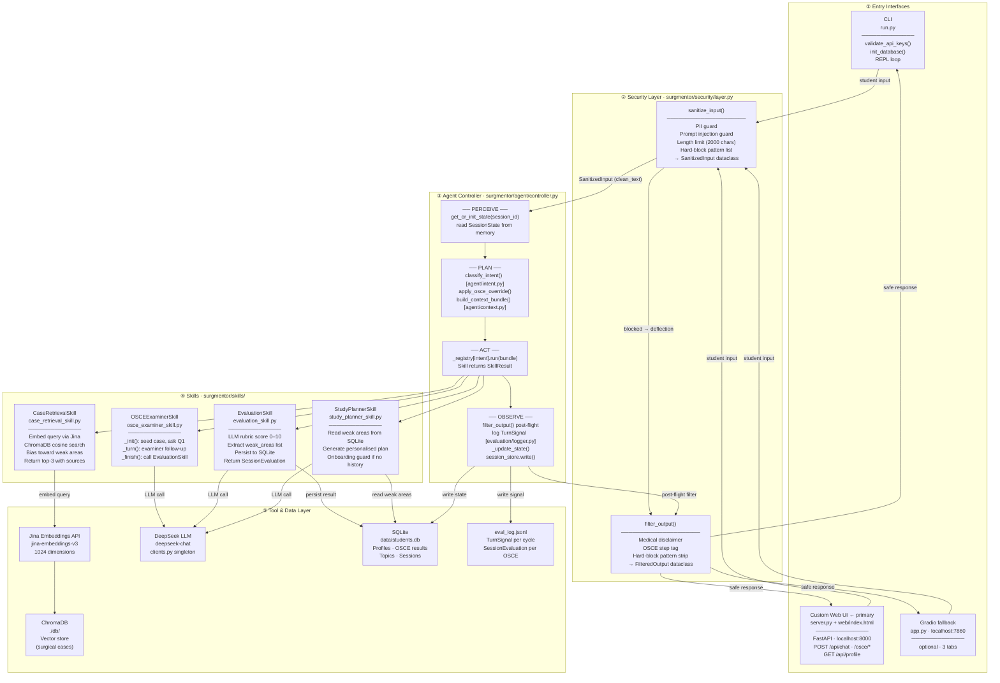

# SurgMentor — System Architecture

SurgMentor is structured in five strict layers: student input enters through one of
three entry interfaces (CLI, custom web UI, or optional Gradio fallback), passes
through the Security Layer for pre-flight sanitization, is processed by the Agent
Controller's perceive → plan → act → observe loop, routed to one of four composable
Skills, and then passes back through the Security Layer for post-flight output
filtering before being returned to the student. All persistent state lives in two
storage components — ChromaDB (vector search) and SQLite (student profiles) —
which are accessed only through named tool functions, never directly from skills or
the controller.

---

## Full System Diagram

---

## Layer-by-Layer Description

### ① Entry Interfaces

Three thin wrappers over the controller. All call `controller.run(input_text,
session_id)` — no business logic lives in the interface layer.

**`run.py` — CLI (terminal REPL).** Reads `stdin`, forwards to
`controller.run()`, prints to `stdout`. Useful for scripted testing and
development without a browser.

**`server.py` + `web/index.html` — Custom Web UI (primary, recommended).**
A FastAPI application that exposes a REST API (`POST /api/chat`,
`POST /api/osce/start`, `POST /api/osce/turn`, `POST /api/osce/finish`,
`POST /api/osce/reset`, `GET /api/profile`, `POST /api/profile/plan`) and
serves a single-page HTML/CSS/JavaScript application from `web/index.html`.
The SPA provides Chat, OSCE, and Profile views with a six-step OSCE progress
indicator. Launch: `python -m uvicorn server:app --host 0.0.0.0 --port 8000`.

**`app.py` — Gradio fallback (optional).** A three-tab Gradio application
(Case Retrieval, OSCE Examination, Student Profile) that calls the same
`controller.run()` function. Available as a fallback or for Hugging Face Spaces
deployment. Launch: `python app.py` → `http://localhost:7860`.

### ② Security Layer (`surgmentor/security/layer.py`)

The security layer wraps every agent cycle at two points. Pre-flight:
`sanitize_input()` checks for PII patterns (names, phone numbers, email addresses),
prompt injection attempts (`ignore previous instructions` and variants), overlong
inputs (> 2000 characters), and hard-block clinical danger patterns (specific drug
doses that could cause harm if acted on). If any check fails, the layer returns
a `SanitizedInput` with `is_blocked=True` and the controller returns a deflection
message without invoking any skill. Post-flight: `filter_output()` injects the
medical disclaimer ("This is an educational simulation, not clinical advice"),
appends an OSCE step tag when the session is active, and strips any hard-block
patterns that appear in LLM output. This two-point wiring is the named,
independently-testable Security Features component required by the course.

### ③ Agent Controller (`surgmentor/agent/controller.py`)

The cognitive core. `AgentController.run()` executes the four-step ADK loop:
**PERCEIVE** reads or initialises `SessionState` from the session store; **PLAN**
classifies student intent into one of 7 `IntentCategory` values via LLM or
rule-based fallback, applies the OSCE override rule (if `osce_active=True` and
intent is not `FINISH_OSCE`, route to `OSCE_TURN` regardless), and builds a
per-skill trimmed `ContextBundle`; **ACT** invokes the registered skill and catches
exceptions; **OBSERVE** filters output, logs a `TurnSignal`, updates session state,
and writes the state back to memory. The controller is stateless between calls —
all state lives in the session store.

### ④ Skills (`surgmentor/skills/`)

Four composable, stateless skill classes, each a concrete implementation of the
`Skill` abstract base class. Every skill receives a `ContextBundle` and returns a
`SkillResult`. Skills never access the session store directly, never call other
skills directly (except the documented `OSCEExaminerSkill → EvaluationSkill`
pipeline on finish), and are independently testable without the controller. The
skill registry in the controller maps each `IntentCategory` to one skill instance.

### ⑤ Tool & Data Layer

Three external dependencies (Jina Embeddings API, DeepSeek LLM, ChromaDB) accessed
only through named tool functions in `surgmentor/rag/retrieval_tool.py` and
`clients.py`. Two local stores (ChromaDB in `./db/`, SQLite in `data/students.db`)
hold the vector index and student profiles respectively. `eval_log.jsonl` is a
write-only append log produced by the evaluation layer — one JSON object per agent
cycle, structured for post-hoc analysis.
